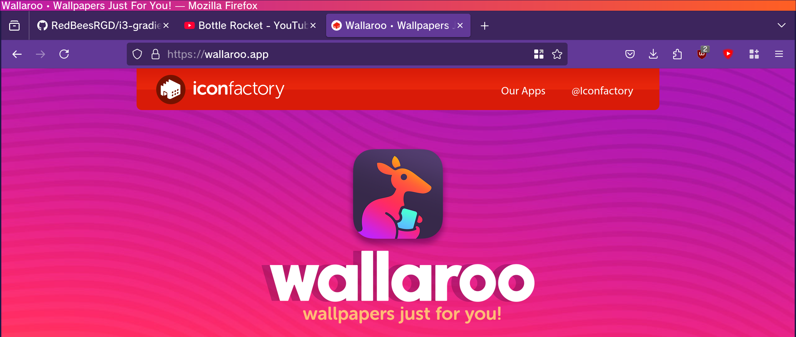
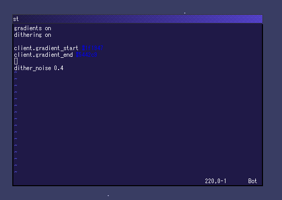

<p>
    <h1 align="center"> i3-gradients</h1>
    
    <div align="center"><b><i>It's got style, originality and lots of flair!</i></b>
</p>

i3 with highly customizable gradient titlebars, dithering effects, and more coming soon!

# Examples





# Setup
</div>
There aren't any binary distributions yet, so you'll have to build from source.

<br>

If you are on Arch or another platform with source packages, you can install the package for stock i3 (AUR: [i3-git](https://aur.archlinux.org/packages/i3-git)) to pull in the dependencies. Advanced users can read the <a href="meson.build">meson.build</a> file to see the dependencies - you may also need your distribution's i3 development package such as `i3-devel`. You will also need Meson itself.

Once you have the dependencies: 

- `git clone https://github.com/RedBeesRGD/i3-gradients.git`
- `cd i3-gradients && mkdir build`
- `meson setup build/`
- `cd build && meson compile` -> generates an `i3-gradients` binary in the `build` folder

**Xinit users** can modify their [xinit](https://wiki.archlinux.org/title/Xinit) script or `startx` command to launch the `i3-gradients` binary instead of `i3`.

**Display manager users** (only tested with SDDM) can run `meson install` to make i3-gradients available as an option in their DM. **If you are using a desktop environment like KDE or GNOME, this is what you want - the 'display manager' is your login screen.**

<div align="center"><h1>Configuration</h1></div>

i3-gradients uses its own configuration file. The locations are the same as stock i3 but with `i3` changed to `i3-gradients`, such as `~/.config/i3-gradients/config`. The format is the same as the regular i3 configuration file with a few new options added.

* Toggle gradients: `gradients on/off`
* Toggle dithering: `dithering on/off`
* Gradient colors: `client.gradient_start/end #(hex color)`
* Unfocused window gradient colors: `client.gradient_unfocused_start/end #(hex color)`
* Gradient width: `client.gradient_offset_start/end (number)`(floating-point number between 0 and 1 - default is 0 for start and 1 for end) - **this currently only works if dithering is disabled**
* Dithering level: `dither_noise (number)` (floating-point number, recommended range 0-1, default is 0.5)

Here is an example config which replicates the default values:

```
gradients on
dithering off
dither_noise 0.5

client.gradient_start #1f1947
client.gradient_end #2e9ef4

client.gradient_unfocused_start #303331
client.gradient_unfocused_end #9da6a0

client.gradient_offset_start 0
client.gradient_offset_end 1
```

If you are already an i3 user, copy your existing config to an `i3-gradients` location and add these lines, adjusting to your taste. 

As with most i3 configuration options, you can see your changes immediately after saving the config by reloading with `$mod+Shift+c`.

<div align="center"><h1>For users new to i3</h1></div>
If you are new to i3, you will want to run it once to generate the default config and read the introductory message about the modifier key, then add the above lines.

<br>

i3 can be challenging for new users - there are many resources already online on how to configure and use it. Here are our basic recommendations for people who wish to try out i3:

* Install+configure `i3bar` and `dmenu`
* Adjust the configuration file to map `$mod+Return` to the terminal of your choice
* Use a program like `feh` to set a desktop wallpaper, if desired
* Learn the basics of i3's keyboard commands and the i3 keybind configuration - the [i3 reference card](https://i3wm.org/docs/refcard.html) may be useful.

<div align="center"><h1>Future plans</h1></div>

Here are a few features we plan to (hopefully) eventually add, ultimately extending this project into a general visual enhancements fork of i3:

* Config item for adjusting the number of colors used by the dithering algorithm
* Adding support for offset control in dithered mode & adding offset control for the dithering itself
* Options to apply gradients to more elements, such as window borders and the i3bar
* Further window decorations such as themable window control buttons & textures
* Glass transparency (Aero-esque)
* Moving gradients
* Rounded corners
* Select different gradients for different windows/window groups
* Sway version

<div align="center"><h1>Known bugs</h1></div>

* Title bar rendering breaks in tabbed mode when dithering is enabled.

<div align="center"><h1>Contributions</h1></div>

PRs and issues are gratefully accepted. The license is the BSD license used by i3 itself. The repo owner can be contacted on Discord `@redbees`.